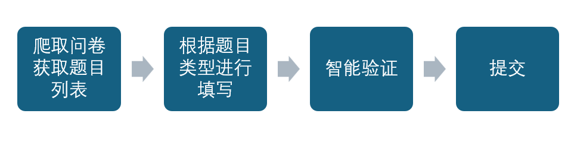
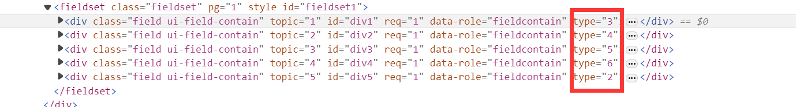
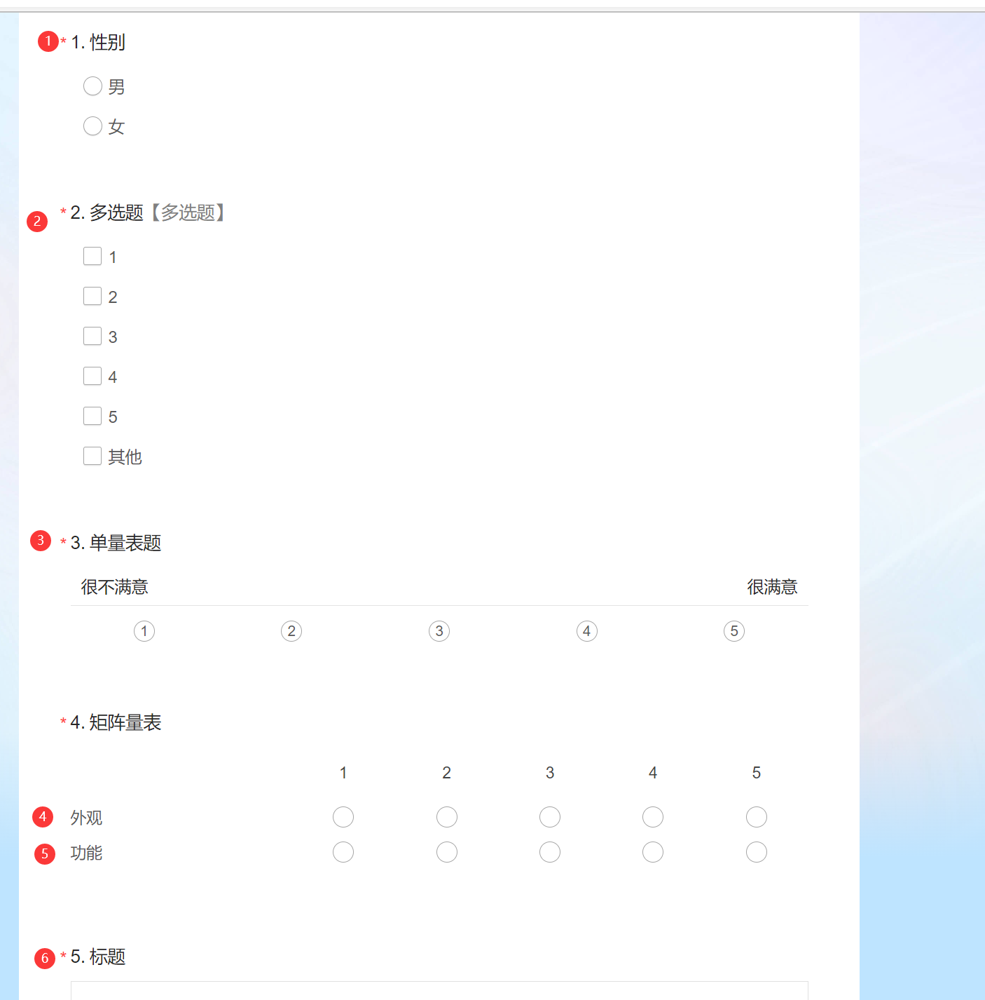

## wjx-auto-fill
#### 有用的话请给个star。谢谢

### 简介

该项目使用selenium实现问卷自动填写。支持IP切换、题项比例设定以及问卷填写方式(通过微信、QQ还是链接填写)

### 实现思路



#### 1.爬取问卷

```python
driver = webdriver.Edge()
driver.get(url)
```

#### 2.获取题目类型

通过xpath获取每个题目，并通过get_attribute获取题目类型，根据不同的题目类型采取的填写方式不同，可以通过浏览器的开发者模式查看题目类型，现在可以可以实现单选、多选、单量表、矩阵量表、简答、选择、打分



```python
xpath = '//*[@id="div{}"]'.format(i)
question = driver.find_element(By.XPATH, xpath)
# 获取题目类型
flag = question.get_attribute("type")
```

#### 3.智能验证

你使用selenium进行问卷填写在提交的时候一定会触发智能验证。

```python
# 请点击智能验证码进行验证！
try:
    comfirm = driver.find_element(By.XPATH, '//*[@id="layui-layer1"]/div[3]/a')
    comfirm.click()
    time.sleep(0.5)
except Exception as e:
    pass

# 点击按钮开始智能验证
try:
    button = driver.find_element(By.XPATH, '//*[@id="SM_BTN_WRAPPER_1"]')
    button.click()
    time.sleep(3)
except Exception as e:
    pass

# 滑块验证
try:
    slider1 = driver.find_element(By.XPATH, '//*[@id="nc_1__scale_text"]/span')
    if str(slider1.text).startswith("请按住滑块，拖动到最右边"):
        width = slider1.size.get('width')
        slider = driver.find_element(By.XPATH, '//*[@id="nc_1_n1z"]')
        ActionChains(driver).drag_and_drop_by_offset(slider, width, 0).perform()
        time.sleep(3)
except Exception as e:
    pass
```

#### 4.提交

完成智能验证就可以提交问卷

### 使用方法

只需要修改config.py文件中的配置就可以执行
其中的IP API提取链接需要自己去IP代理网站生成，如果你选择爬取网上免费的IP代理，你需要自己修改代码爬取，并生成自己的IP代理池

```python
# 问卷链接
url = ""
# 填写分数
epochs = 400
# 题项比例
prob = {
    1: [1, 1],
    2: [1, 1, 1, 2, 2, 0],
    3: [1, 1, 1, 2, 2],
    4: [1, 1, 1, 2, 2],
    5: [1, 1, 1, 2, 2],
}
# 简答题题库
answerList = {
    6: ["123", "12"]
}
# IP API提取链接 如果不是通过API提取，请根据自己的情况修改相应建立IP代理池的代码
api = ""
# User-Agent库 第一个为浏览器、第二个为微信、第三个为QQ
UA = ["Mozilla/5.0 (Windows NT 10.0; Win64; x64) AppleWebKit/537.36 (KHTML, like Gecko) Chrome/121.0.0.0 Safari/537.36 Edg/121.0.0.0",
      "Mozilla/5.0 (Linux; Android 10; SEA-AL10 Build/HUAWEISEA-AL10; wv) AppleWebKit/537.36 (KHTML, like Gecko) Version/4.0 Chrome/86.0.4240.99 XWEB/4313 MMWEBSDK/20220805 Mobile Safari/537.36 MMWEBID/9538 MicroMessenger/8.0.27.2220(0x28001B53) WeChat/arm64 Weixin NetType/WIFI Language/zh_CN ABI/arm64",
      "Mozilla/5.0 (Linux; Android 11; Redmi Note 8 Pro Build/RP1A.200720.011; wv) AppleWebKit/537.36 (KHTML, like Gecko) Version/4.0 Chrome/89.0.4389.72 MQQBrowser/6.2 TBS/045913 Mobile Safari/537.36 V1_AND_SQ_8.8.68_2538_YYB_D A_8086800 QQ/8.8.68.7265 NetType/WIFI WebP/0.3.0 Pixel/1080 StatusBarHeight/76 SimpleUISwitch/1 QQTheme/2971 InMagicWin/0 StudyMode/0 CurrentMode/1 CurrentFontScale/1.0 GlobalDensityScale/0.9818182 AppId/537112567 Edg/98.0.4758.102",
      ]
```

请注意题目顺序，矩阵量表中的每一项都属于一个题目

